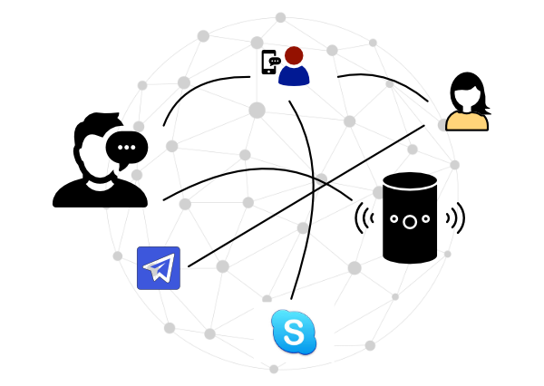

# Direct Message

This is a simple skill that is used to directly reach out and message
the owner of an avatar you know.

Because we leverage the infrastructure of the network and the node, this
skill can reach the user across multiple channels - "Jack" can use
**Telegram** to message "Jill" who gets the message on **Alexa** or
"John" who responds via **XBox** or **Skype**.

## Contributions
Anyone looking to contribute can add the following features:

1. Rate Limiting
2. Encryption
3. Friendly Name Mapping
